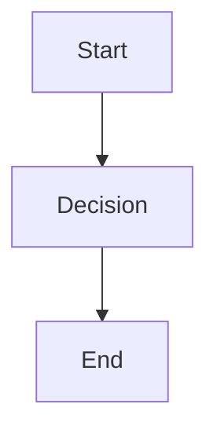

# MkDocs Documentation Setup

This project uses [MkDocs](https://www.mkdocs.org/) with the
[Material theme](https://squidfunk.github.io/mkdocs-material/) to generate and
deploy professional documentation to GitHub Pages.

## 🚀 Quick Start

### Prerequisites

- Python 3.8+
- Git repository

### Local Development

1. **Install Dependencies**

   ```bash
   pip install -r docs/requirements.txt
   ```

2. **Start Development Server**

   ```bash
   mkdocs serve
   ```

3. **Access Documentation**
   - Local: http://localhost:8000
   - Auto-reloads on file changes

### Build Static Site

```bash
mkdocs build
```

Output will be in the `site/` directory.

## 📁 Structure

```
docs/
├── index.md              # Homepage
├── getting-started/      # Getting started guides
├── business/            # Business documentation
├── architecture/        # Technical architecture
├── phases/             # Implementation phases
└── plan.md             # Project plan
```

## 🔧 Configuration

### mkdocs.yml Features

- **Material Design** theme with dark/light mode toggle
- **Navigation tabs** for better organization
- **Search functionality** with highlighting
- **Code syntax highlighting** with copy buttons
- **Mermaid diagrams** support
- **Emoji support** for better visual appeal
- **Git revision dates** (when in git repository)

### Theme Customization

- **Colors**: Blue primary with accent
- **Features**: Navigation breadcrumbs, table of contents, search
- **Extensions**: Admonitions, tabs, code highlighting

## 🚀 Automatic Deployment

### GitHub Actions Workflow

The documentation automatically deploys to GitHub Pages when:

- Changes are pushed to `main` branch
- Changes affect files in `docs/` or `mkdocs.yml`

### Workflow Features

- **Build Validation**: Tests documentation builds on pull requests
- **Automatic Deployment**: Deploys to GitHub Pages on main branch
- **Caching**: Speeds up builds with pip caching
- **Error Handling**: Fails fast on build errors

### Setup GitHub Pages

1. **Enable GitHub Pages**
   - Go to repository Settings → Pages
   - Select "GitHub Actions" as source

2. **Configure Repository**
   - Ensure `mkdocs.yml` has correct `site_url`
   - Update `repo_name` and `repo_url` in config

3. **Push Changes**
   - Workflow runs automatically
   - Documentation available at: `https://username.github.io/repository-name/`

## 📝 Writing Documentation

### Markdown Features

**Admonitions (Callout Boxes)**

```markdown
!!! info "Information"
This is an info box

!!! warning "Warning"
This is a warning box

!!! tip "Pro Tip"
This is a tip box
```

**Code Blocks with Language**

````markdown
```python
def hello_world():
    print("Hello, World!")
```
````

**Tabbed Content**
```markdown
=== "Tab 1"
    Content for tab 1

=== "Tab 2"
    Content for tab 2
```

**Mermaid Diagrams**

````markdown

````

```

### Navigation

Edit the `nav` section in `mkdocs.yml`:

```yaml
nav:
  - Home: index.md
  - Section:
    - Page: section/page.md
```

## 🔍 Local Testing

### Test Build

```bash
# Test build (fails fast on errors)
mkdocs build --strict

# Test with clean build
mkdocs build --clean
```

### Test Links

```bash
# Start server
mkdocs serve

# Test in browser
# Check all internal links work
# Verify navigation structure
```

## 🚨 Troubleshooting

### Common Issues

**Git Plugin Warnings**

- Solution: Ensure you're in a git repository or set `fallback_to_build_date: true`

**Build Failures**

- Check markdown syntax
- Verify all linked files exist
- Test locally before pushing

**Navigation Issues**

- Update `mkdocs.yml` nav section
- Check file paths are correct
- Ensure no spaces in filenames

**GitHub Pages Not Updating**

- Check Actions tab for workflow failures
- Verify GitHub Pages is enabled
- Check repository permissions

### Debug Commands

```bash
# Verbose build output
mkdocs build --verbose

# Check configuration
mkdocs config

# Validate navigation
mkdocs serve --verbose
```

## 📊 Analytics & Monitoring

The documentation includes:

- **Git revision dates** for content freshness
- **Search analytics** (if configured)
- **GitHub integration** with edit links

## 🎯 Best Practices

1. **Keep it Simple** - Clear navigation, consistent structure
2. **Use Admonitions** - Highlight important information
3. **Code Examples** - Always include practical examples
4. **Visual Hierarchy** - Use headers, lists, and formatting effectively
5. **Cross-Reference** - Link related sections together
6. **Keep Updated** - Regular reviews and updates

---

**Documentation is built and deployed automatically via GitHub Actions!** 🚀
