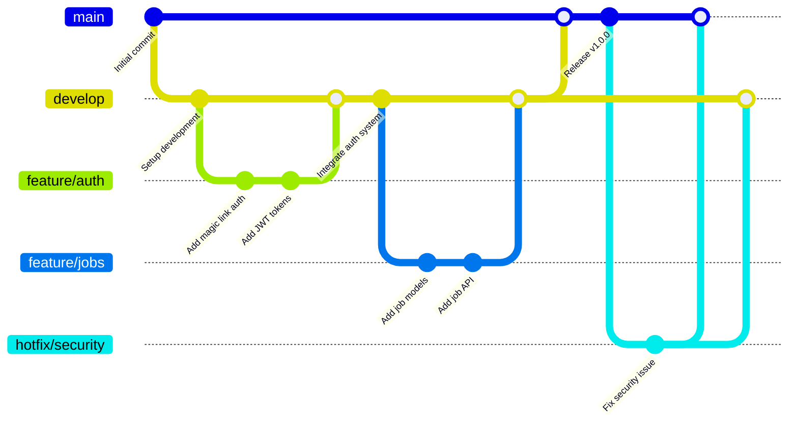

# Development Workflow Guide

This guide outlines the development workflow for the Safe Job Platform, including branching strategy, pull request process, and quality gates.

## 🌳 Branching Strategy

### Branch Types

| Branch Type | Pattern | Purpose | Lifespan |
|-------------|---------|---------|----------|
| **Main** | `main` | Production-ready releases | Permanent |
| **Develop** | `develop` | Integration of completed features | Permanent |
| **Feature** | `feature/description` | Individual feature development | Temporary |
| **Hotfix** | `hotfix/description` | Emergency production fixes | Temporary |
| **Documentation** | `docs/description` | Documentation updates | Temporary |

### Branch Flow Diagram



## 🚀 Development Workflow

### 1. Starting New Work

```bash
# Update your local repository
git checkout develop
git pull origin develop

# Create feature branch
git checkout -b feature/authentication-system

# Or for documentation
git checkout -b docs/api-documentation
```

### 2. Development Process

```bash
# Make your changes
# ... code, test, document ...

# Commit with conventional format
git add .
git commit -m "feat: implement magic link authentication

- Add email verification system  
- Create JWT token management
- Add rate limiting for auth endpoints

Closes #123"

# Push to remote
git push -u origin feature/authentication-system
```

### 3. Creating Pull Requests

#### PR Title Format
```
type(scope): brief description

Examples:
feat(auth): implement magic link authentication
fix(jobs): resolve location search bug  
docs(api): add authentication endpoints
refactor(models): optimize database queries
```

#### PR Description Template
```markdown
## 📋 Summary
Brief description of changes and motivation.

## 🔄 Type of Change
- [ ] Bug fix
- [ ] New feature  
- [ ] Documentation update
- [ ] Refactoring
- [ ] Performance improvement

## 🧪 Testing
- [ ] Unit tests added/updated
- [ ] Integration tests pass
- [ ] Manual testing completed

## 📚 Documentation
- [ ] Code comments updated
- [ ] API documentation updated
- [ ] User documentation updated

## 🔍 Checklist
- [ ] Code follows project style guidelines
- [ ] Self-review completed
- [ ] Breaking changes documented
- [ ] Related issues linked
```

### 4. Review and Merge Process

#### Automated Checks
Every PR triggers these checks:
- **Build validation** - Code compiles/builds successfully
- **Test suite** - All tests pass
- **Documentation** - Docs build without errors  
- **Security scan** - No obvious security issues
- **Code quality** - Linting and formatting checks

#### Manual Review Process
1. **Self-review** - Review your own PR first
2. **Request review** - Assign reviewers (yourself for solo development)
3. **Address feedback** - Make requested changes
4. **Final approval** - Get approval before merging

#### Merge Strategies

**For Feature Branches → Develop:**
- Use **"Squash and merge"** to keep clean history
- Ensure commit message follows conventional format

**For Develop → Main:**
- Use **"Create a merge commit"** to preserve feature history
- Tag releases after merging to main

## 🛡️ Branch Protection Rules

### Main Branch Protection
- ✅ Require pull request reviews (1 reviewer)
- ✅ Require status checks to pass
- ✅ Require up-to-date branches
- ✅ Include administrators
- ✅ Require conversation resolution

### Develop Branch Protection  
- ✅ Require status checks to pass
- ❌ Require pull request reviews (flexibility for solo dev)
- ✅ Require up-to-date branches

### Feature Branch Guidelines
- No protection rules (development flexibility)
- Automated checks still run on push
- Regular cleanup of merged branches

## 📋 Phase-Based Development

### Phase Workflow
Each development phase follows this pattern:

```bash
# Start phase
git checkout develop
git pull origin develop
git checkout -b feature/phase-1-foundation

# Work through phase tasks
# ... implement, test, document ...

# Regular commits during phase
git add .
git commit -m "feat(foundation): complete Docker setup"

git add .  
git commit -m "feat(foundation): add CI/CD pipeline"

# Complete phase
git push origin feature/phase-1-foundation

# Create PR: feature/phase-1-foundation → develop
# After review and merge, move to next phase
```

### Phase Completion Checklist
- [ ] All phase tasks completed
- [ ] Tests written and passing
- [ ] Documentation updated
- [ ] Phase deliverables validated
- [ ] Ready for next phase

## 🔥 Hotfix Process

### Emergency Production Fixes

```bash
# Start from main
git checkout main
git pull origin main
git checkout -b hotfix/critical-security-fix

# Make minimal fix
# ... fix only the critical issue ...

git add .
git commit -m "fix: resolve critical authentication vulnerability

- Patch JWT token validation
- Add input sanitization  
- Update security headers

Security advisory: SA-2024-001"

# Push and create PR to main
git push -u origin hotfix/critical-security-fix

# Create PR: hotfix/critical-security-fix → main
# After merge, also merge to develop

git checkout develop
git pull origin develop
git merge main  # Or create separate PR
git push origin develop
```

## 📊 Quality Gates

### Automated Quality Checks

1. **Build Validation**
   - Code compiles without errors
   - Dependencies resolve correctly
   - Configuration files valid

2. **Test Coverage**
   - Unit tests pass
   - Integration tests pass  
   - Minimum coverage thresholds met

3. **Documentation Standards**
   - MkDocs builds successfully
   - No broken internal links
   - API documentation updated

4. **Security Scanning**
   - No hardcoded secrets detected
   - Dependency vulnerabilities checked
   - Basic security patterns validated

5. **Code Quality**
   - Linting rules enforced
   - Consistent formatting
   - No obvious code smells

### Manual Quality Checks

- **Functionality** - Feature works as intended
- **User Experience** - Good UX/UI implementation
- **Performance** - No obvious performance issues  
- **Security** - Security considerations addressed
- **Documentation** - Clear and complete documentation

## 🏷️ Release Management

### Versioning Strategy
- **Semantic Versioning** (MAJOR.MINOR.PATCH)
- **v1.0.0** - Initial MVP release
- **v1.1.0** - New features added
- **v1.0.1** - Bug fixes only

### Release Process

```bash
# Prepare release
git checkout main
git pull origin main

# Create and push tag
git tag -a v1.0.0 -m "Release version 1.0.0 - MVP

Features:
- Magic link authentication
- Job posting and matching
- Real-time messaging
- Document management

See CHANGELOG.md for details."

git push origin v1.0.0

# Update develop with any hotfixes
git checkout develop
git merge main
git push origin develop
```

## 🧹 Maintenance

### Regular Cleanup

```bash
# List merged branches
git branch --merged develop

# Delete merged feature branches (local)
git branch -d feature/completed-feature

# Delete merged feature branches (remote)
git push origin --delete feature/completed-feature

# Prune remote tracking branches
git remote prune origin
```

### Weekly Review
- Clean up merged branches
- Review open PRs
- Update documentation
- Check security updates

---

This workflow ensures high code quality while maintaining development velocity! 🚀